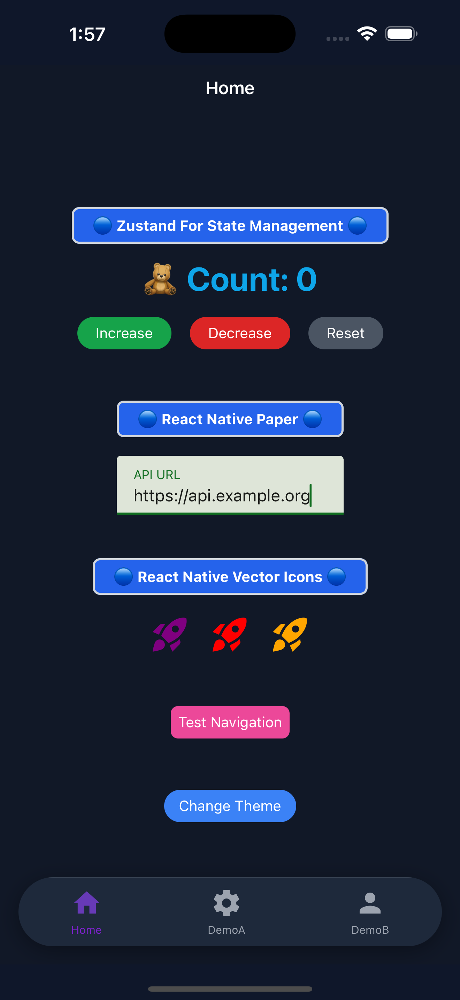
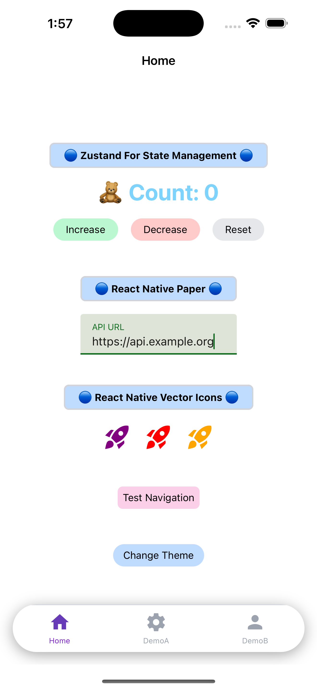

# React Native Boilerplate

A modern, opinionated and scalable React Native boilerplate to kickstart your next mobile application.

## 📱 Screenshots

<div align="center" style="display: flex; gap: 1rem;">
   
   
</div>

## 🚀 Quick Start

```bash
npx kickstart-native-cli init
```

## ✨ Features

- Written in TypeScript
- Pre-configured folder structure
- Built-in navigation setup
- State management configuration
- Theming and styling system
- Testing setup with Jest
- Linting and formatting with ESLint & Prettier
- Nativewind Setup
- Navigation Setup
- React Native Paper Setup
- Zustand For State Management
- MMKV for a faster storage usage
- Environment configuration
- Component library

## 📁 Project Structure

```
src/
   ├── ui/          # Reusable components
   ├── navigation/  # Navigation configuration
   ├── screens/     # Screen components
   ├── store/       # State management
   ├── hooks/       # Custom Hooks
   ├── storage/     # Storage configuration
   └── utils/       # Utility functions
```

## 📝 Requirements

- Node.js >= 20
- npm or yarn
- React Native development environment

## 🛠 Development

1. Install dependencies:

```bash
yarn install
```

2. Run the app:

```bash
# iOS
yarn ios

# Android
yarn android
```

## 📚 Documentation

For detailed documentation, please visit our [Wiki](https://github.com/gen-dead-X/kickstart-native-cli#readme/#readme).

## 🤝 Contributing

Pull requests are welcome. For major changes, please open an issue first to discuss what you would like to change.

## 📄 License

MIT
